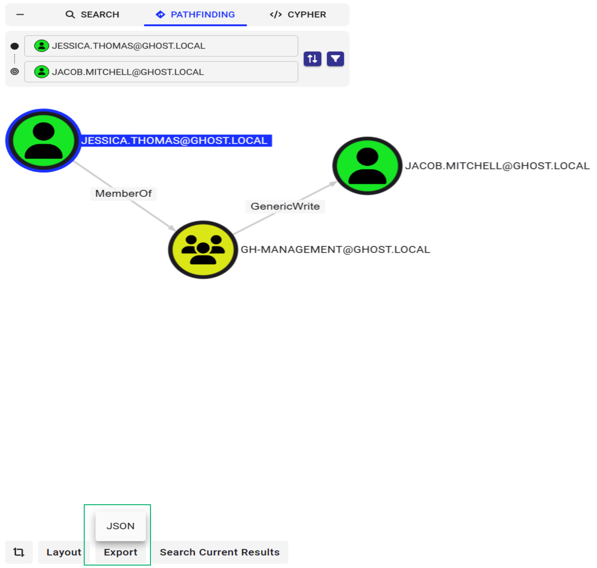

[](https://github.com/bagelByt3s/LudusHound)


# LudusHound

LudusHound brings BloodHound data to life by creating a fully functional Ludus Range for controlled testing. It builds an Active Directory mirror environment based on previously collected BloodHound data, allowing red teams to simulate attack paths and exploit misconfigurations in a near-production lab before targeting actual systems. For blue teams, LudusHound provides an environment to prepare defenses and practice hardening against AD attacks, ensuring they can test configuration changes in an accurate lab environment.

## Ansible Roles
LudusHound contains ansible roles used to replicate the AD environment 

```
- bagelByt3s.ludushound.upload_bloodhound_files
- bagelByt3s.ludushound.upload_ludushound_scripts
- bagelByt3s.ludushound.configure_dns_forwarders
- bagelByt3s.ludushound.create_bloodhound_users
- bagelByt3s.ludushound.create_bloodhound_computers
- bagelByt3s.ludushound.create_bloodhound_groups
- bagelByt3s.ludushound.create_bloodhound_gpos
- bagelByt3s.ludushound.create_bloodhound_containers
- bagelByt3s.ludushound.create_bloodhound_ous
- bagelByt3s.ludushound.configure_dns_forwarders_child_domains
- bagelByt3s.ludushound.create_bloodhound_domaintrusts
- bagelByt3s.ludushound.configure_relationship_domain_group_members
- bagelByt3s.ludushound.configure_relationship_local_group_members
- bagelByt3s.ludushound.configure_relationship_ou_members_computers
- bagelByt3s.ludushound.configure_relationship_ou_members_users
- bagelByt3s.ludushound.configure_relationship_ou_members_groups
- bagelByt3s.ludushound.configure_relationship_dcsync
- bagelByt3s.ludushound.configure_relationship_sessions
- bagelByt3s.ludushound.configure_relationship_genericall
- bagelByt3s.ludushound.configure_relationship_genericwrite
- bagelByt3s.ludushound.configure_relationship_forcechangepassword
- bagelByt3s.ludushound.configure_relationship_gplink
- bagelByt3s.ludushound.download_helper_tools
- bagelByt3s.ludushound.promote_to_child_dc
- bagelByt3s.ludushound.disable_password_policy
- bagelByt3s.ludushound.create_domainadmin
- bagelByt3s.ludushound.join_nondomain_computer_to_domain
- bagelByt3s.ludushound.attackpath_configure_domain
- bagelByt3s.ludushound.attackpath_configure_localgroup
- bagelByt3s.ludushound.attackpath_configure_session
- bagelByt3s.ludushound.attackpath_configure_attackjson
- bagelByt3s.ludushound.attackpath_upload_scripts
```

## Installation

### Install Ansible Roles

#### Using Ansible Collection
```
git clone https://github.com/bagelByt3s/LudusHound /opt/LudusHound
ludus ansible collection add https://github.com/bagelByt3s/LudusHound/raw/refs/heads/main/Collections/bagelByt3s-ludushound-1.0.0.tar.gz
```

#### Using local directory
```sh
/opt/LudusHound/install-roles.sh install # you can pass -u <ludus-user> if you are targeting a different user 
```

## Requirements
```
- Ludus
- Network Access to BloodHound CE
- Go
```

## Build LudusHound 

```sh
cd /opt/LudusHound
go mod init LudusHound
go mod tidy 
go get gopkg.in/yaml.v3
go build
```

## Run LudusHound 
Create Ludus range and retrieve AD object info from BloodHound server

```sh
./LudusHound --Server 127.0.0.1 --User neo4j -Pass bloodhoundcommunityedition --Output LudusRanges/LudusHound.yml --AliveComputers TITAN.GHOST.LOCAL,Eclipse.Child.Ghost.Local,Avalanche.Specter.Local,RAVEN.GHOST.LOCAL,Nova.Child.Ghost.Local,Mirage.Specter.Local

Server: 127.0.0.1
User: neo4j
Password: bloodhoundcommunityedition
Output: LudusRanges/LudusHound.yml
Directory to save BloodHound Files: ./Tmp/2025-06-06_20-16-53

Domain Identified:  SPECTER.LOCAL
Retreiving AD Objects for  SPECTER.LOCAL
Domain Identified:  GHOST.LOCAL
Retreiving AD Objects for  GHOST.LOCAL
Domain Identified:  CHILD.GHOST.LOCAL
Retreiving AD Objects for  CHILD.GHOST.LOCAL

Retrieving object relationship mapping for all domains and saving to:
./Tmp/2025-06-06_20-16-53/Relationships/Relationships.json

Data successfully saved to ./Tmp/2025-06-06_20-16-53/filesMap.json
Generating Ludus YML Config:
Creating config for TITAN.GHOST.LOCAL
Creating config for ECLIPSE.CHILD.GHOST.LOCAL
Creating config for AVALANCHE.SPECTER.LOCAL
Creating config for RAVEN.GHOST.LOCAL
Creating config for NOVA.CHILD.GHOST.LOCAL
Creating config for MIRAGE.SPECTER.LOCAL

Writing Ludus Range to LudusRanges/LudusHound.yml

```
### Run LudusHound with local roles
```sh
./LudusHound -LocalRoles -Server 127.0.0.1 -User neo4j -Pass bloodhoundcommunityedition -Output LudusRanges/LudusHound.yml -AliveComputers TITAN.GHOST.LOCAL,Eclipse.Child.Ghost.Local,Avalanche.Specter.Local,RAVEN.GHOST.LOCAL,Nova.Child.Ghost.Local,Mirage.Specter.Local
```
## Run LudusHound without querying BloodHound server
 The filesMap.json file is created every time a BloodHound data is collected with the --Server, --User, and --Pass argument. This file can be fed into LudusHound so that it does not have to query the BloodHound server every time.

```sh
 ./LudusHound  --FilesMapJson ./Tmp/2025-04-11_16-54-39/filesMap.json --Output LudusRanges/LudusHound.yml --AliveComputers hydrogen.covertius.local,rikers.cyberpartners.local,zeus.citadel.covertius.local,arsenic.covertius.local,alcatraz.cyberpartners.local,heracles.citadel.covertius.local

Provided FilesMapJson file: ./Tmp/2025-04-11_16-54-39/filesMap.json

AliveComputers:
    hydrogen.covertius.local
    rikers.cyberpartners.local
    zeus.citadel.covertius.local
    arsenic.covertius.local
    alcatraz.cyberpartners.local
    heracles.citadel.covertius.local

Output:  LudusRanges/LudusHound.yml

Generating Ludus YML Config:
Creating config for HYDROGEN.COVERTIUS.LOCAL
Creating config for RIKERS.CYBERPARTNERS.LOCAL
Creating config for ZEUS.CITADEL.COVERTIUS.LOCAL
Creating config for ARSENIC.COVERTIUS.LOCAL
Creating config for ALCATRAZ.CYBERPARTNERS.LOCAL
Creating config for HERACLES.CITADEL.COVERTIUS.LOCAL


Writing Ludus Range to LudusRanges/LudusHound.yml


```

## Deploy Ludus Range
```sh
ludus range config set -f LudusRanges/LudusHound-Range.yml
ludus range deploy
```

## Created Ludus Range with AttackPath Json file 

If you don't want to create the entire Active Directory environment, you can use LudusHound to create a Ludus Range of a specific Attack Path from BloodHound. This will only create the objects and nodes in the provided JSON file. 

To obtain the JSON file, navigate towards the desired Attack Path in BloodHound, click the `EXPORT` button which will download a JSON file that contains the nodes and edges in the desired Attack Path.



Simply provide this JSON file to LudusHound to create the stripped down down Ludus range. 

```sh
./LudusHound --AttackPath graph.json  --DomainController TITAN.GHOST.LOCAL --Output LudusRanges/AttackPath.yml
Successfully created Ludus range configuration at: LudusRanges/AttackPath.yml

```


## Credits 

This amazing tool idea originally came from Erik Hunstad/@kernel-sanders, the creator of Ludus, who gave me permission to develop and build it.

Huge thank you to Jonathan Owens/@DragoQCC, Zach Stein/@Synzack, and Garrett Foster/@unsigned_sh0rt who helped with tool design. This would not be where it is without all of that planning and discussion.


